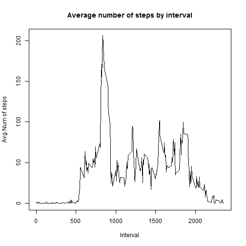
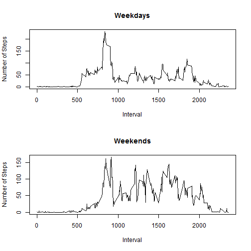

##Introduction

This essay will analyse data collected from a personal activity monitoring device.  Data was collected at five minute intervals throughout the day during October and November of 2012.  The number of steps taken in each five minute interval was recorded.

## Loading and preprocessing the data

```r
Act<-read.csv("Activity.csv")
```
The data appear in a table with 3 columns: steps, date, and interval.  The data appear to be tidy and nicely formatted.  Certain questions will require processing to answer those questions, but the data appear to be in a format suitable for analysis.

## What is mean total number of steps taken per day?

The first goal is to calculate the total number of steps taken each day.  I did this using the dplyr package.  The code creates a new data frame that give the total steps taken by date.

```r
library(dplyr)
byDate<-Act %>% group_by(date) %>% summarise(sum(steps))
colnames(byDate)<-c("date","steps")
```
We can analyse the results with a histogram.  This will let us see the distribution of the total steps taken each day.


```r
library(ggplot2)
ggplot(data=byDate,aes(byDate$step))
```

```
## Error: No layers in plot
```

```r
      +geom_histogram(col="red", fill="blue")
```

```
## Error in +geom_histogram(col = "red", fill = "blue"): invalid argument to unary operator
```

```r
      +labs(x="Steps Taken",y="Count")
```

```
## Error in +labs(x = "Steps Taken", y = "Count"): invalid argument to unary operator
```

We compute the mean and median of the steps taken by day:

```r
options(scipen=6)
mean<-round(mean(byDate$steps, na.rm=TRUE),2)
median<-median(byDate$steps, na.rm=TRUE)
```
The mean is found to be 10766.19, and the median is 10765.  These were computed while ignoring missing values.


## What is the average daily activity pattern?

Next, we are interested to see how the activity rate varies by 5-minute interval.  (That is throughout the day).  The code below creates a data frame containing the average number of steps across all days by 5-minute interval and plots a time-series graph.

```r
byInt<-Act %>% group_by(interval) %>% summarise(mean(steps,na.rm=TRUE))
colnames(byInt)<-c("Interval","AvgSteps")
plot(byInt$Interval,byInt$AvgSteps,type="l", 
     xlab="Interval",ylab="Avg Num of steps", 
     main="Average number of steps by interval" )
```

 

We are interested in what interval contains the largest average number of steps (and what that number is).  The following code gets this row.


```r
byInt[which.max(byInt$AvgSteps),]
```
We see that interval 835 has the largest average number of steps which is 206.1698113.


## Imputing missing values

However, this analysis is not perfect because many of the entries in the steps column were not measured and are recorded as NA.  To get the number of such entries, we call:

```r
sum(is.na(Act$steps))
```

```
## [1] 2304
```

We decide to fill in the missing data with the average number of steps taken during that time interval.  We call the new data frame Actfilled.


```r
Actfilled<-NULL
Actfilled$date<-Act$date
Actfilled$interval<-Act$interval
for(i in 1:nrow(Act)){
      if(is.na(Act$steps[i]))
      Actfilled$steps[i]<-byInt$AvgSteps[byInt$Interval==Act$interval[i]]
      else Actfilled$steps[i]<-Act$steps[i]}
Actfilled<-as.data.frame(Actfilled)
```
We make a histogram number of steps taken each day in this new data frame.


```r
byDatefilled<-Actfilled %>% group_by(date) %>% summarise(sum(steps))
colnames(byDatefilled)<-c("date","steps")
ggplot(data=byDatefilled,aes(byDatefilled$step))
```

```
## Error: No layers in plot
```

```r
      +geom_histogram(col="blue", fill="red")
```

```
## Error in +geom_histogram(col = "blue", fill = "red"): invalid argument to unary operator
```

```r
      +labs(x="Steps Taken",y="Count")
```

```
## Error in +labs(x = "Steps Taken", y = "Count"): invalid argument to unary operator
```

We compute the mean and median of the steps taken by day:

```r
options(scipen=6)
meanf<-round(mean(byDatefilled$steps, na.rm=TRUE),2)
medianf<-median(byDatefilled$steps, na.rm=TRUE)
```
The mean is found to be 10766.19, and the median is 10766.19.  Recall the values computed ignoring the na values were round(mean,2)` and 10765.  We see the means are the same and the median is very slightly larger.


## Are there differences in activity patterns between weekdays and weekends?

We now look at the difference in activity between weekends.  We need to reformat the date column since it is currently a factor.  Then we add a column that says either "weekend" or "weekday."


```r
Actfilled$date<-as.Date(Actfilled$date)
for(i in 1:nrow(Actfilled))
{if(grepl("Saturday|Sunday",weekdays(Actfilled$date[i]))) 
      Actfilled$Wknd[i]<-"weekend" 
      else Actfilled$Wknd[i]<-"weekday"
}
```
We make time series plots for weekdays and weekends:

```r
Intbywknd<-Actfilled %>% group_by(Wknd,interval) %>% summarise(mean(steps))
colnames(Intbywknd)<-c("Wknd","Interval", "Avgsteps")
par(mfrow=c(2,1))
plot(Intbywknd[Intbywknd$Wknd=="weekday",]$Interval,Intbywknd[Intbywknd$Wknd=="weekday",]$Avgsteps, 
     type="l",xlab="Interval",ylab="Number of Steps", main="Weekdays")
plot(Intbywknd[Intbywknd$Wknd=="weekend",]$Interval,Intbywknd[Intbywknd$Wknd=="weekend",]$Avgsteps, 
     type="l",xlab="Interval",ylab="Number of Steps", main="Weekends")
```

 

We see that the weekday and weekend patterns are different.  The weekday pattern has one predominant spike, while the weekend pattern is moderately high throughout the middle of the day and afternoon- probably due to "weekend warriors."
